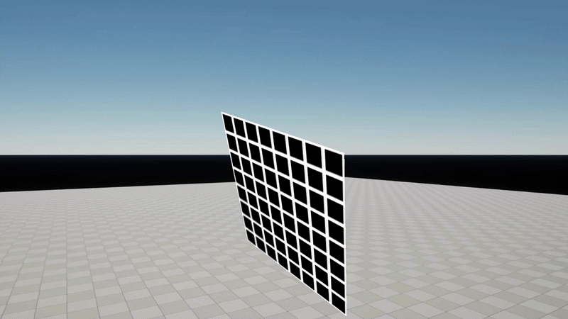

# MGVertexComputeDemo Plugin

This plugin serves as a base for interfacing with the Unreal Engine 5 render pipeline. It demonstrates how to use the Render Graph (RDG) to execute compute shaders and draw custom geometry directly into the scene.

### Overview
The plugin is designed to show a complete workflow for custom rendering. It starts by calculating vertex data in a compute shader and then uses that same data in a standard vertex and pixel shader pass. This approach is useful for any effect that requires dynamic geometry or data manipulation on the GPU before drawing.

### Core Components
The system relies on a few key Unreal Engine rendering features. It uses an `FSceneViewExtension` to hook into the render thread at the right time, specifically during the `PostRenderView` phase. This ensures that custom drawing happens relative to the current camera view and respects engine-level transformations.

The logic is contained within `MGVertexComputeComponent`, which manages the transition from game-thread data to the render-thread execution. It captures the actor's transformation and passes it to the Render Graph for use in coordinate calculations.

### Render Graph Workflow
The plugin implements a simple but effective RDG pipeline. It creates structured buffers for vertices and UVs, which are first populated by a compute shader (`MGVertexComputeShader.usf`). Once the data is ready, a separate graphics pass (`MGVertexComputeGraphicsShader.usf`) is dispatched. This pass uses the compute-generated buffers as input to draw a quad in the world.

### Coordinate Precision
To handle the large-scale coordinates in Unreal Engine 5, the plugin uses `TranslatedWorldToClip` matrices and `PreViewTranslation`. This ensures that even when the camera is far from the world origin, the custom geometry remains stable and free from precision-related jitter.

### Implementation

To start using the plugin, it needs to be enabled in the project settings under the "Plugins" menu. Once active, the core functionality is accessed through the `MGVertexComputeComponent`.

This component can be added to any actor in the world. You can either create a new actor and add the component or attach it to an existing static mesh actor. Because the plugin renders custom geometry using a texture provided by the user, you should assign a valid `TargetTexture` within the component's properties. This texture will be sampled during the pixel shader pass and applied to the generated quad.
